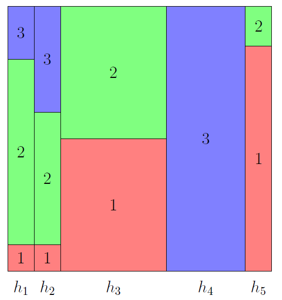
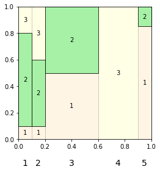

Makes square diagrams using tikz and matplotlib.

For example:

A square diagram is a square divided into columns of different widths, and
each column divided into rectangles of different heights. It can be used, for
example, to represent a Bayesian experiment: a hypothesis's prior is
represented by the corresponding column's width, and the likelihood of an
outcome given the hypothesis is represented by the corresponding rectangle's
height.

In addition, by making all rectangles except those corresponding to a
particular outcome semi-transparent, a square diagram also helps illustrate
Bayes Theorem.

The function tikz_square_diagram prints tikz instructions. (TikZ is a LaTeX
package.) If you copy and paste the instructions into your LaTeX document, with
the tikz package installed, it will make a square diagram. The function
plt_square_diagram is similar, but creates a matplotlib figure instead, so
doesn't require LaTeX.