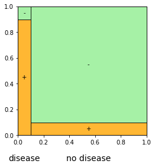
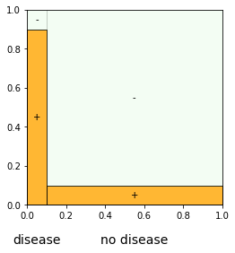

Makes square diagrams using tikz and matplotlib.

A square diagram is a square divided into columns of different widths, and each column divided into rectangles of different heights. It can be used, for example, to represent a Bayesian experiment: a hypothesis's prior is represented by the corresponding column's width, and the likelihood of an
outcome given the hypothesis is represented by the corresponding rectangle's height.

In addition, by making all rectangles except those corresponding to a particular outcome semi-transparent, a square diagram helps illustrate Bayes Theorem.

**Example 1.** In my bag are coins of various biases: four are 45%-heads biased, one is 50%-heads biased, three are 55%-heads biased. I draw a coin from the bag at random. To learn about its bias, I flip it four times and count the number of heads.

We can represent this experiment with a square diagram, either using tikz or matplotlib:

  

    
  

  

    
  

The function **tikz_square_diagram** prints tikz instructions, which, when copied and pasted into LaTeX with the tikz package installed, produces a square diagram like the one on the left. The function **plt_square_diagram** produces a matplotlib figure like the one on the right.

Bayes Rule says: after observing the result of the experiment, multiply your priors by the likelihoods and re-proportion so they add up to 1, giving your posteriors. We can illustrate Bayes Rule using the square diagrams. For example, suppose I count three heads:

  

    
  

  

    
  

Bayes Rule becomes: your posterior in a hypothesis is the proportion of the outcome's area lying in the hypothesis's column.

It's easy enough to make square diagrams yourself. But these functions speed up the process and don't require knowledge of tikz or matplotlib.

**Example 2: Monty Hall.** You're on a gameshow, facing three doors: A, B and C. A car is behind one of the doors and goats are behind the other two. You pick a door: A, say. The host, who knows what's behind each door, will open either B or C, according to a certain rule. As it happens, she opens B.

We can use square diagrams to represent your credences about the situation, depending on the rule the host is following, both before and after the host opens the door.

Rule 1: The host opens either B or C at random.

Rule 2: The host opens whichever door, B or C, has a goat behind it, and if both do then she opens one at random.

Rule 3: The host opens whichever door, B or C, has a goat behind it, and if both do then she opens B.

**Example 3: base rate fallacy.** A test for a disease is 90%-reliable: if you have the disease, there's a 90% chance the test comes back positive; if you don't, there's a 90% chance the test comes back negative. Before taking the test, you are 90% sure you don't have the disease. But the test comes back positive.

  

    
  

  

    
  

