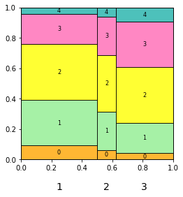
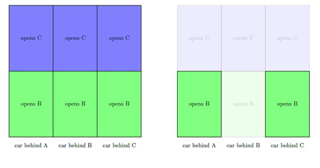
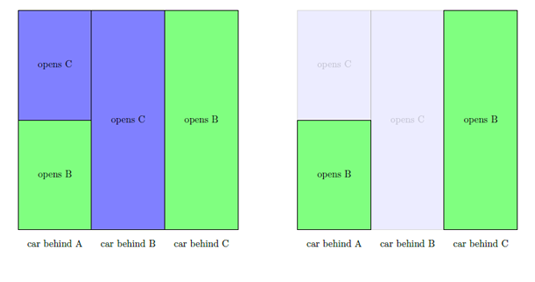

# README

The module `square_diagrams.py` provides functions to make square diagrams using tikz or matplotlib.

A square diagram is a square divided into columns of different widths, with each column divided into rectangles of different heights.

Square diagrams can be used, for example, to represent a Bayesian experiment: hypotheses are represented by columns, with widths proportional to priors; outcomes are represented by rectangles, with heights proportional to likelihoods. The diagram can be taken in at a glance. In addition, by making all rectangles semi-transparent except those representing a particular outcome, the diagram helps illustrate Bayes Theorem.

It's easy enough to make square diagrams yourself from scratch. But these functions speed up the process and don't require knowledge of tikz or matplotlib. They're intended to help make illustrations for teaching.

## Example 1: a paradigm experiment

In my bag are coins of various biases: four are 45%-heads biased, one is 50%-heads biased, three are 55%-heads biased. I draw a coin from the bag at random. To learn about its bias, I flip it four times and count the number of heads.

The function `tikz_square_diagram()` prints tikz instructions, which, when copied and pasted into LaTeX with the tikz package installed, produces a square diagram.

```
>>> from square_diagrams import *
>>> priors = [4/8, 1/8, 3/8]
>>> likelihoods = [[.092, .299, .368, .200, .041],
... [.0625, .250, .375, .250, .0625],
... [.041, .200, .368, .299, .092]]
>>> tikz_square_diagram(priors, likelihoods)
[tikz instructions are printed here]
```

<p align="center">

</p>

The function `plt_square_diagram()` creates a matplotlib figure.

```
>>> plt_square_diagram(priors, likelihoods)
>>> plt.show()
```

<p align="center">

</p>

Note:
  - `plt_square_diagram()` returns the `fig` and `ax` objects, so you can modify the plot.
  - For both functions, you can customize the column labels (), rectangle labels, and colors using the `col_labels`, `rect_labels` and `colors` parameters, which each accept a list of strings.

Bayes Rule says: after observing the result of the experiment, multiply your priors by the likelihoods and re-proportion so they add up to 1, giving your posteriors. We can illustrate Bayes Rule by providing the relevant outcome label&mdash;in this case, `'3'`&mdash;to the `special_label` parameter using the square diagrams.

For example, suppose I count three heads.

Using tikz:

```
>>> labels = ['45\%', '50\%', '55\%']
>>> tikz_square_diagram(priors, likelihoods, col_labels=labels, special_label='3')
[tikz instructions are printed here]
```

<p align="center">

</p>

(The backslashes before the `%` in `labels` are needed because `%` is a reserved character in LaTeX.)

Using matplotlib:

```
>>> labels = ['45%', '50%', '55%']
>>> plt_square_diagram(priors, likelihoods, col_labels=labels, special_label='3')
>>> plt.show()
```

<p align="center">

</p>

Bayes Rule becomes: your posterior in a hypothesis is the proportion of the outcome's area lying in the hypothesis's column.

## Example 2: Monty Hall

You're on a gameshow, facing three doors: A, B and C. Behind one of the doors is a car and behind the other two are goats. You pick a door: A, say. The host, who knows what's behind each door, will open either B or C, according to a certain rule. As it happens, she opens B and reveals a goat.

We can use square diagrams to represent your beliefs about the situation, depending on the rule the host is following, both before and after the host opens B and reveals a goat.

*Rule 1:* The host opens either B or C at random.

<p align="center">

</p>

*Rule 2:* The host opens whichever door, B or C, has a goat behind it, and if both do then she opens one at random.

<p align="center">

</p>

*Rule 3:* The host opens whichever door, B or C, has a goat behind it, and if both do then she opens B.

<p align="center">

</p>

## Example 3: base rate fallacy

A test for a disease is 90%-reliable: if you have the disease, there's a 90% chance the test comes back positive; if you don't, there's a 90% chance the test comes back negative. Before taking the test, you are 90% sure you don't have the disease. But the test comes back positive.

<p align="center">

</p>

The picture clarifies the base rate fallacy: the fallacy is to assume the taller rectangle has the larger area, forgetting that width matters too.